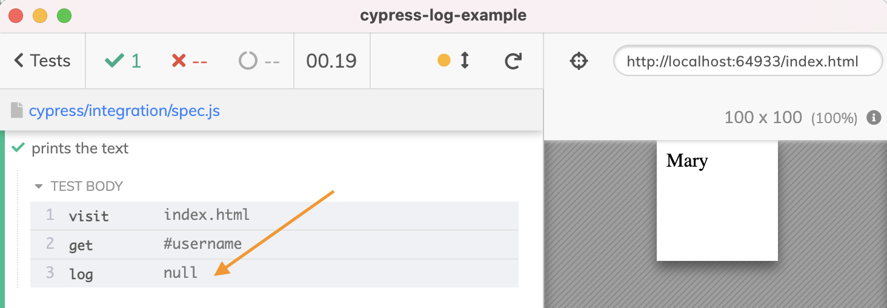
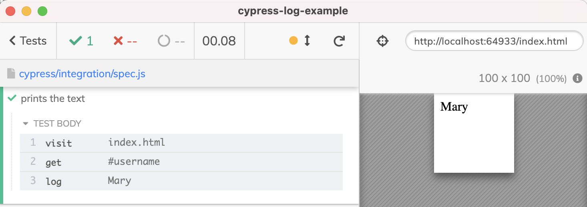

# cypress-log-example
> Example repo for blog post "Why cy.log prints nothing"

The problem

The fixed test prints the expected result

See the tests in [cypress/integration/spec.js](./cypress/integration/spec.js)

## More information

- [Cypress tips and tricks](https://glebbahmutov.com/blog/cypress-tips-and-tricks/)
